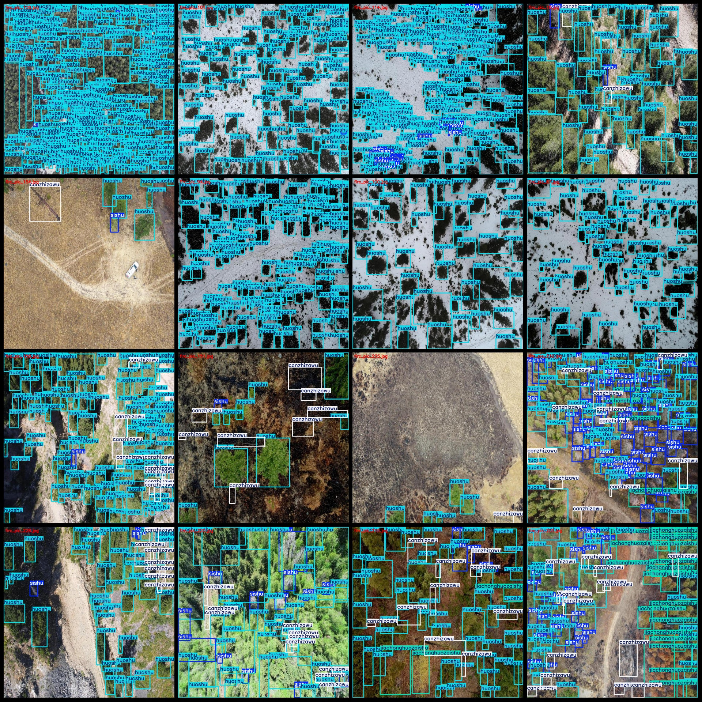
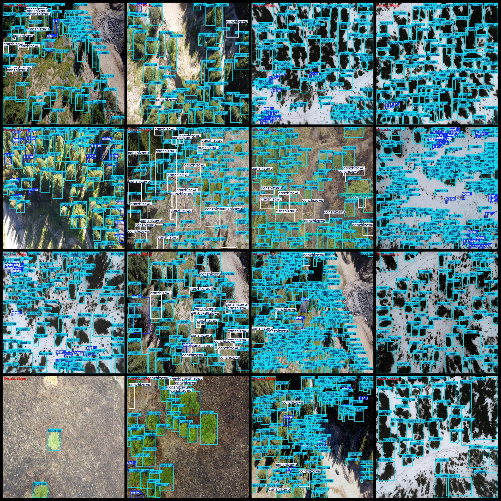

# UAV Viewpoint Aerial Photo Dataset for Tree Health Status Detection with VOC+YOLO Format and 276 Images in 4 Categories

The dataset format is: Pascal VOC format + YOLO format (excluding the split path, containing only jpg images and corresponding VOC format XML files and YOLO format txt files).
Number of images (jpg file count): 276
Number of annotations (xml file count): 276
Number of annotations (txt file count): 276
Number of annotation categories: 4
Annotation category names (notice that the order of categories in the YOLO format does not correspond to this, but is based on the labels folder's classes.txt): ["canzhizawu", "huoshu", "jiachonghuozaishu", "sishu"]
["Broken branches and rubbish", "Living tree", "Fire-breathing tree with ants", "Dead tree"]
The number of boxes for each category:
canzhizawu = 2427
huoshu = 27346
jiachonghuozaishu = 2336
To find the number of sishu boxes that can fit in a frame with a total width of 3466 units, we need to determine how many sishu boxes can be arranged in a row or column without exceeding the width.

Assuming that each sishu box is a square and has a side length of $s$, then the maximum width of one row of sishu boxes would be $3466 / s$.

Similarly, the maximum height of one column of sishu boxes would also be $3466 / s$.

However, since we don't have the specific dimensions of each sishu box, we cannot calculate the exact number of boxes that can fit in the frame. If we assume a certain size for each box (e.g., $s = 10$ units), we could use the formula:

Number of boxes = $\frac{total\_width}{s} \times \frac{total\_height}{s}$

where $total\_width$ is the total width of the frame, and $total\_height$ is the total height of the frame.

For example, if $s = 10$, then:

Number of boxes = $\frac{3466}{10} \times \frac{3466}{10} = 3466^2$

This will give us the approximate number of sishu boxes that can fit in the frame.
The total number of frames is 35,575.
Number of images per category:
Can you describe the relationship between "canzhizawu" and "photographs"?
The number of images owned by Huoshu is 276.
The number of pictures owned by Jiachonghuozaishu is 96.
The number of pictures owned by Sishu is 211.
Image resolution: 1024x1024
To use the labelImg tool, you need to have a labeled image dataset. The tool will then analyze the images and generate annotations for each object in the image.
Annotation rule: Draw a rectangle around the class.
Important Note: The dataset does not have splits for training, validation, and testing. Please split it yourself.
Special Notice: This dataset does not guarantee the accuracy of the trained models or weight files.
Preview of the image:
## Images

Here is a pay link on Stripe ( https://buy.stripe.com/3cs8yP7sY87d0vu9AB ). Please contact me lonlonago@foxmail.com after funding $89, and I will send you a complete data files , thank you!

